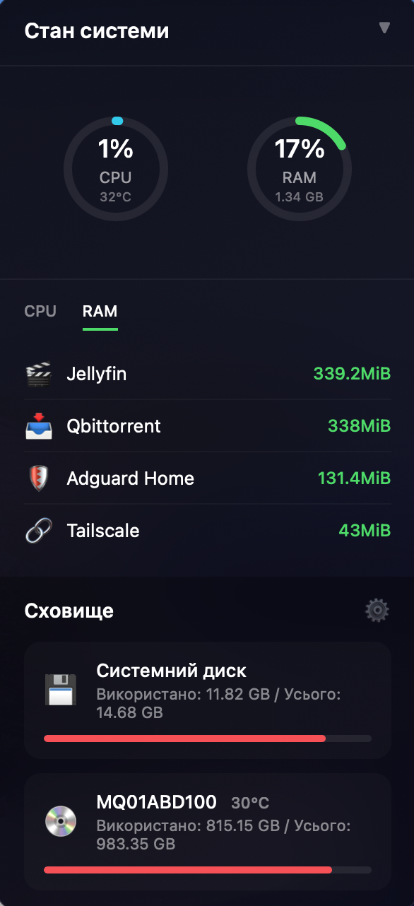
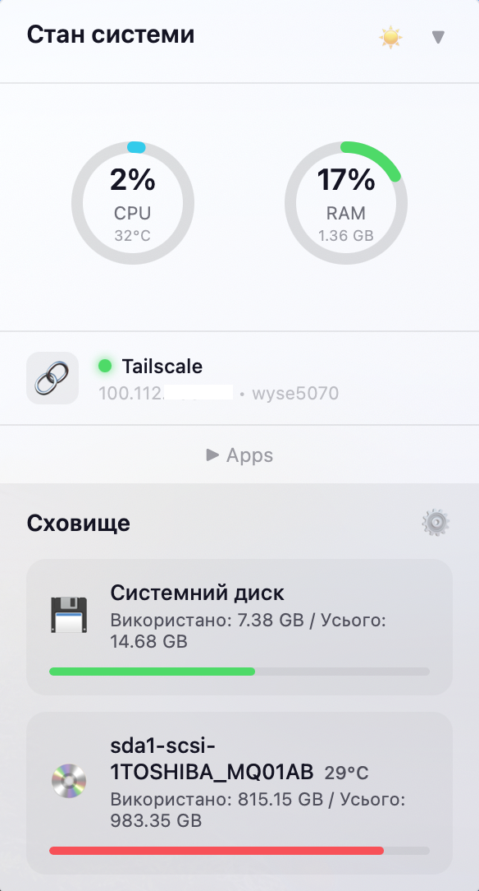

# CasaOS Widget for Übersicht

A beautiful macOS desktop widget that displays real-time system statistics from your CasaOS server.

| Dark Theme | Light Theme |
|:---:|:---:|
|  |  |

## Features

- **System Monitoring** - CPU, RAM usage with temperature display
- **Docker Containers** - Running containers with CPU/RAM stats (normalized to 100%)
- **Top Consumer Highlight** - Most resource-intensive container highlighted with ⚡
- **Clickable Apps** - Click container icon to open web UI (auto-detects port)
- **Storage** - Auto-detected disks with usage and temperature
- **Tailscale** - Connection status, IP and hostname (visible even when offline)
- **Themes** - Light, Dark, and Auto (follows macOS)
- **Collapsible** - Minimize widget or apps section
- **Localization** - 20 languages supported
- **Live Updates** - Refreshes every 6 seconds

## Requirements

- macOS with [Übersicht](http://tracesof.net/uebersicht/)
- CasaOS server accessible via SSH
- SSH key authentication configured

## Quick Start

```bash
# 1. Clone to widgets folder
cd ~/Library/Application\ Support/Übersicht/widgets/
git clone https://github.com/zloi2ff/casaos-widget.git casaos.widget

# 2. Set up SSH key
ssh-keygen -t ed25519
ssh-copy-id username@your-server-ip

# 3. Configure
cd casaos.widget
cp config.example.sh config.sh
# Edit config.sh with your server details

# 4. Make executable
chmod +x fetch-stats.sh
```

Edit `casaos.jsx` and update `widgetPath` with your username, then refresh Übersicht.

## Configuration

Edit `config.sh`:

```bash
SERVER_HOST="192.168.1.100"      # Your CasaOS server IP
SERVER_USER="your_username"      # SSH username
SUDO_PASS="your_password"        # For docker stats (optional)
```

## Features in Detail

### Clickable App Icons
- Click any container icon to open its web UI
- Ports auto-detected via `docker port`
- Priority: 8080 → 8xxx-9xxx → 3xxx → 80/443

### Themes
Click theme icon to cycle: Auto (◐) → Dark → Light

### Tailscale Status
- Works with native Tailscale and Docker container
- Shows online/offline, IP, hostname

### Localization
Auto-detects system language:
English, Ukrainian, German, French, Spanish, Italian, Polish, Portuguese, Dutch, Chinese, Japanese, Korean, Turkish, Hindi, Arabic, Indonesian, Vietnamese, Thai, Swedish, Czech

## Customization

Widget position in `casaos.jsx`:
```css
top: 20px;
left: 20px;
```

Refresh rate:
```javascript
export const refreshFrequency = 6000; // milliseconds
```

## Troubleshooting

| Issue | Solution |
|-------|----------|
| Server unavailable | Check SSH: `ssh user@server-ip` |
| CPU shows 0% | Install sysstat: `sudo apt install sysstat` |
| No disk temperature | Install smartmontools: `sudo apt install smartmontools` |

## License

MIT License

## Credits

Created for [CasaOS](https://casaos.io/) and [Übersicht](http://tracesof.net/uebersicht/)
